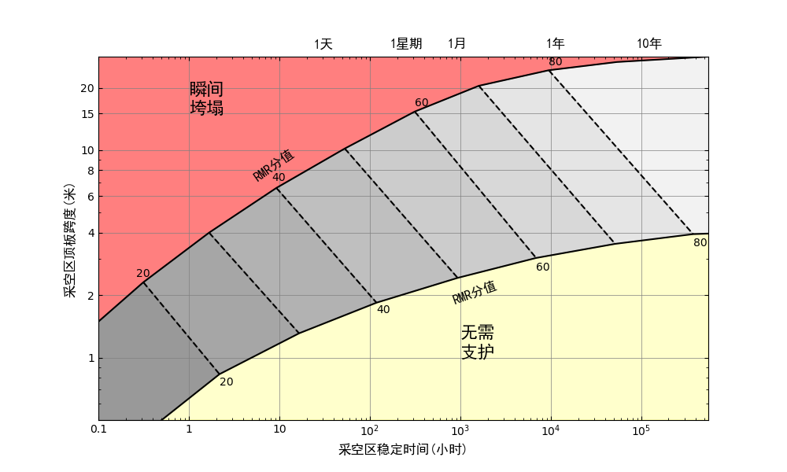
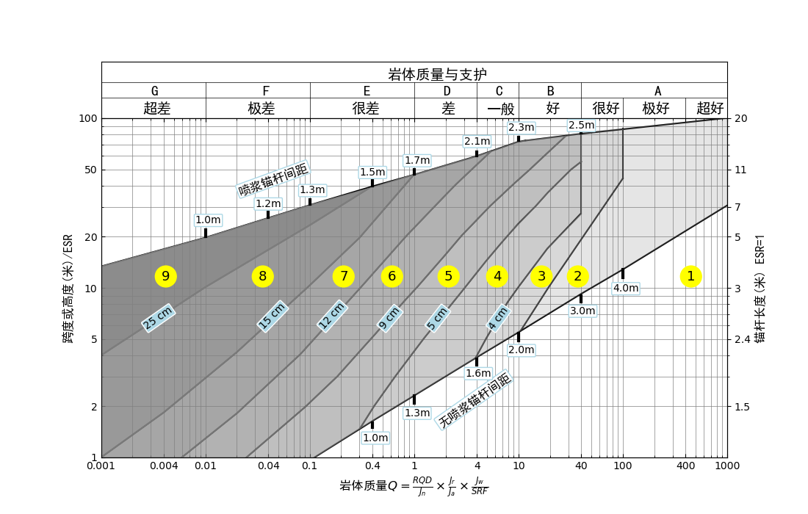
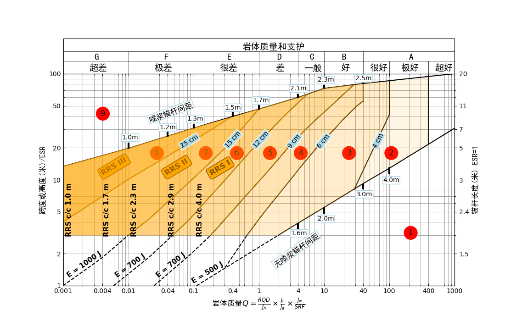
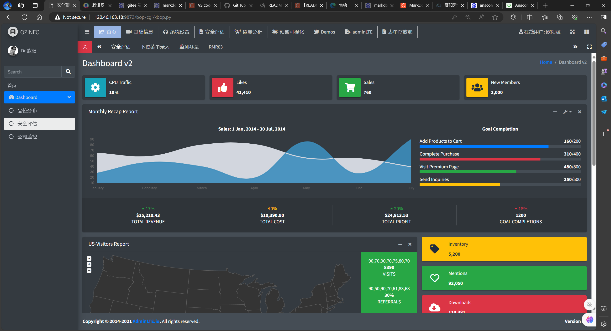
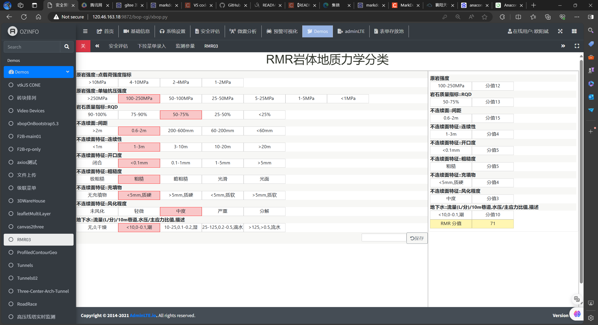

# 岩体力学中文版Q和RMR分类图
## 简介Q分类[1,(1993年版)、2,(2022年版)]与RMR分类[3] 已广泛的使用在岩体工程中。但由于Q分类和RMR分类的原始图均为英文注释，本项目利用Engauge Digitizer
[4]从上述文献的英文版的Q分类图和RMR分类图中提取原始数据，每条曲线（或分段曲线）数据存为csv文件，通过python的matplotlib库，实现Q分类图和RMR分类图的中文化。

## 输出结果
### RMR分类图[3]

### Q分类图(1993版)[1]

### Q分类图(2022版)[2]

## python代码及曲线原始数据
python 代码: 
   1. RMR.py, 2. Q-system-1993.py, 3. Q-system-2022.py

曲线原始csv数据分别存于目录:
   1. RMR, 2.  Q-system-1993, 3. Q-system-2022

## 运行环境

 Anaconda 3， python 3.11

## To-Do List
 将基于Apache-Postgresql-Bob平台，提供用户登录的网络版平台，基于用户历史岩体数据和实时监测数据，AI模型，预估岩体稳定性和支护方式。见下面示意图。
 
 

## 参考文献
[1] https://xe.studentorg.berkeley.edu/wp-content/uploads/2024/01/Practical-Rock-Engineering-Full-Text.pdf
[2] https://www.ngi.no/globalassets/bilder/forskning-og-radgivning/bygg-og-anlegg/handbook-the-q-system-may-2015-nettutg_update-june-2022.pdf
[3] https://www.rockmass.net/files/short_on_RMR-system.pdf
[4] https://www.manageengine.com/products/desktop-central/patch-management/Engauge-Digitizer-(x64)-patches/digit-windows10-64-bit-installer-12.1-patch.html
